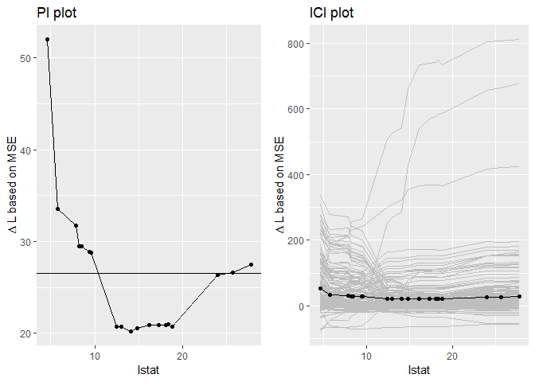
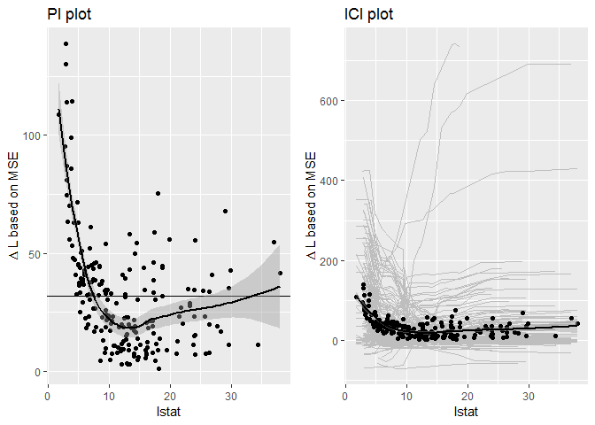
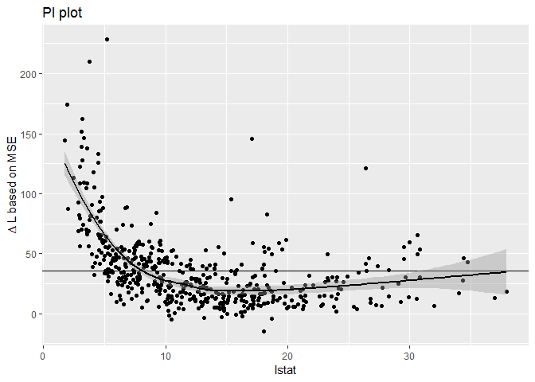

# featureImportance: Model-agnostic permutation feature importance with the [`mlr`](https://github.com/mlr-org/mlr) package

[](http://cran.r-project.org/web/packages/featureImportance)
[](http://cran.rstudio.com/web/packages/featureImportance/index.html)
[](https://travis-ci.org/giuseppec/featureImportance)
[](https://codecov.io/gh/giuseppec/featureImportance)

## Results of the article [“Visualizing the Feature Importance for Black Box Models”](https://arxiv.org/abs/1804.06620)

This R package was developed as a part of the article [“Visualizing the
Feature Importance for Black Box
Models”](https://arxiv.org/abs/1804.06620) accepted at the ECML-PKDD
2018 conference track. The results of the application section of this
article can be reproduced with the code provided
[here](https://github.com/giuseppec/featureImportance/blob/master/ecml-demo/application_results.md).

## Installation of the package

Install the development version from GitHub (using `devtools`)

``` r
install.packages("devtools")
devtools::install_github("giuseppec/featureImportance")
```

## Introduction

The `featureImportance` package is an extension for the
[`mlr`](https://github.com/mlr-org/mlr) package and allows to compute
the permutation feature importance in a model-agnostic manner. The focus
is on performance-based feature importance measures:

  - **Model reliance** and **algorithm reliance**, which is a
    model-agnostic version of [breiman’s permutation
    importance](https://www.stat.berkeley.edu/~breiman/randomforest2001.pdf)
    introduced in the article
    [arXiv:1801.01489v3](https://arxiv.org/abs/1801.01489).
  - **SFIMP** (Shapley Feature Importance)
  - PIMP

## Use case: Compute importance based on test data

This use case computes the feature importance of a model based on a
single test data set. For this purpose, we first build a model (here a
random forest) on training data:

``` r
library(mlr)
library(mlbench)
library(ggplot2)
library(gridExtra)
library(featureImportance)
set.seed(2018)

# Get boston housing data and look at the data
data(BostonHousing, package = "mlbench")
str(BostonHousing)
```

    ## 'data.frame':    506 obs. of  14 variables:
    ##  $ crim   : num  0.00632 0.02731 0.02729 0.03237 0.06905 ...
    ##  $ zn     : num  18 0 0 0 0 0 12.5 12.5 12.5 12.5 ...
    ##  $ indus  : num  2.31 7.07 7.07 2.18 2.18 2.18 7.87 7.87 7.87 7.87 ...
    ##  $ chas   : Factor w/ 2 levels "0","1": 1 1 1 1 1 1 1 1 1 1 ...
    ##  $ nox    : num  0.538 0.469 0.469 0.458 0.458 0.458 0.524 0.524 0.524 0.524 ...
    ##  $ rm     : num  6.58 6.42 7.18 7 7.15 ...
    ##  $ age    : num  65.2 78.9 61.1 45.8 54.2 58.7 66.6 96.1 100 85.9 ...
    ##  $ dis    : num  4.09 4.97 4.97 6.06 6.06 ...
    ##  $ rad    : num  1 2 2 3 3 3 5 5 5 5 ...
    ##  $ tax    : num  296 242 242 222 222 222 311 311 311 311 ...
    ##  $ ptratio: num  15.3 17.8 17.8 18.7 18.7 18.7 15.2 15.2 15.2 15.2 ...
    ##  $ b      : num  397 397 393 395 397 ...
    ##  $ lstat  : num  4.98 9.14 4.03 2.94 5.33 ...
    ##  $ medv   : num  24 21.6 34.7 33.4 36.2 28.7 22.9 27.1 16.5 18.9 ...

``` r
# Create regression task for mlr
boston.task = makeRegrTask(data = BostonHousing, target = "medv")

# Specify the machine learning algorithm with the mlr package
lrn = makeLearner("regr.randomForest", ntree = 100)

# Create indices for train and test data
n = getTaskSize(boston.task)
train.ind = sample(n, size = 0.6*n)
test.ind = setdiff(1:n, train.ind)

# Create test data using test indices
test = getTaskData(boston.task, subset = test.ind)

# Fit model on train data using train indices
mod = train(lrn, boston.task, subset = train.ind)
```

In general, there are two ways how the feature importance can be
computed:

1.  Using fixed feature values: Here, the feature values are set to
    fixed values of the observation specified by `replace.ids`.
2.  Permuting the feature values: Here, the values of the feature are
    randomly permuted `n.feat.perm` times.

### Using fixed feature values

Visualizing the feature importance using fixed feature values is
analogous to partial dependece plots and has the advantage that the
local feature importance is calculated for each observation in the test
data at the same feature
values:

``` r
# Use feature values of 20 randomly chosen observations from test data to plot the importance curves
obs.id = sample(1:nrow(test), 20)

# Measure feature importance on test data
imp = featureImportance(mod, data = test, replace.ids = obs.id, local = TRUE)
summary(imp)
```

    ##     features         mse
    ##  1:    lstat 26.51227057
    ##  2:       rm 20.42330001
    ##  3:      dis  3.93549268
    ##  4:     crim  3.42121482
    ##  5:  ptratio  2.69961656
    ##  6:    indus  2.38307220
    ##  7:      nox  2.11611801
    ##  8:      tax  1.33993270
    ##  9:      age  0.92233763
    ## 10:        b  0.73622817
    ## 11:      rad  0.30748057
    ## 12:       zn  0.08012126
    ## 13:     chas  0.04761391

``` r
# Plot PI and ICI curves for the lstat feature
pi.curve = plotImportance(imp, feat = "lstat", mid = "mse", individual = FALSE, hline = TRUE)
ici.curves = plotImportance(imp, feat = "lstat", mid = "mse", individual = TRUE, hline = FALSE)
grid.arrange(pi.curve, ici.curves, nrow = 1)
```

<!-- -->

### Permuting the feature

Instead of using fixed feature values, the feature importance can also
be computed by permuting the feature values. Here, the PI curve and ICI
curves are evaluated on different randomly selected feature values.
Thus, a smoother is internally used for plotting the curve:

``` r
# Measure feature importance on test data
imp = featureImportance(mod, data = test, n.feat.perm = 20, local = TRUE)
summary(imp)
```

    ##     features         mse
    ##  1:    lstat 31.63230778
    ##  2:       rm 25.93799124
    ##  3:      dis  4.14780627
    ##  4:     crim  3.45685574
    ##  5:  ptratio  2.90229898
    ##  6:    indus  2.53177576
    ##  7:      nox  1.92721909
    ##  8:      tax  1.37084858
    ##  9:      age  1.03519666
    ## 10:        b  0.55239478
    ## 11:      rad  0.30777808
    ## 12:     chas  0.26207277
    ## 13:       zn  0.07047267

``` r
# Plot PI and ICI curves for the lstat feature
pi.curve = plotImportance(imp, feat = "lstat", mid = "mse", individual = FALSE, hline = TRUE)
ici.curves = plotImportance(imp, feat = "lstat", mid = "mse", individual = TRUE, hline = FALSE)
grid.arrange(pi.curve, ici.curves, nrow = 1)
```

<!-- -->

## Use case: Compute importance using a resampling technique

Instead of computing the feature importance of a model based on a single
test data set, one can repeat this process by embedding the feature
importance calculation within a resampling procedure. The resampling
procedure creates multiple models using different training sets, and the
corresponding test sets can be used to calculate the feature importance.
For example, using 5-fold cross-validation results in 5 different
models, one for each cross-validation fold.

``` r
rdesc = makeResampleDesc("CV", iter = 5)
res = resample(lrn, boston.task, resampling = rdesc, models = TRUE)
imp = featureImportance(res, data = getTaskData(boston.task), n.feat.perm = 20, local = TRUE)
summary(imp)
```

    ##     features        mse
    ##  1:    lstat 35.7924727
    ##  2:       rm 24.7044282
    ##  3:      nox  3.7724650
    ##  4:      dis  3.2183559
    ##  5:  ptratio  2.7202109
    ##  6:     crim  2.3033831
    ##  7:    indus  1.9889970
    ##  8:      tax  1.7649915
    ##  9:      age  0.9068749
    ## 10:        b  0.5757160
    ## 11:     chas  0.3392226
    ## 12:      rad  0.3141772
    ## 13:       zn  0.1972672

``` r
plotImportance(imp, feat = "lstat", mid = "mse", individual = FALSE, hline = TRUE)
```

<!-- -->
